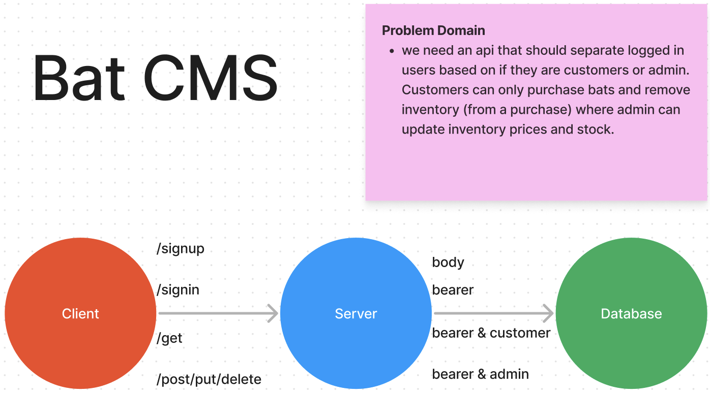

# Auth Api Server

## Server UML

### Tests

#### Account creation and sign in works appropriately

- signup creates new user and sends an object with the user & token back
- signin w basic auth headers logs in a user & sends a resObj back

#### ACL Integration

- the any user should be able to get a resource
- the user with member capabilities should be able to create a model
- the user with member capabilities should NOT be able to update a model
- the user with admin capabilities should be able to update a model
- the user with admin capabilities should be able to delete a model
